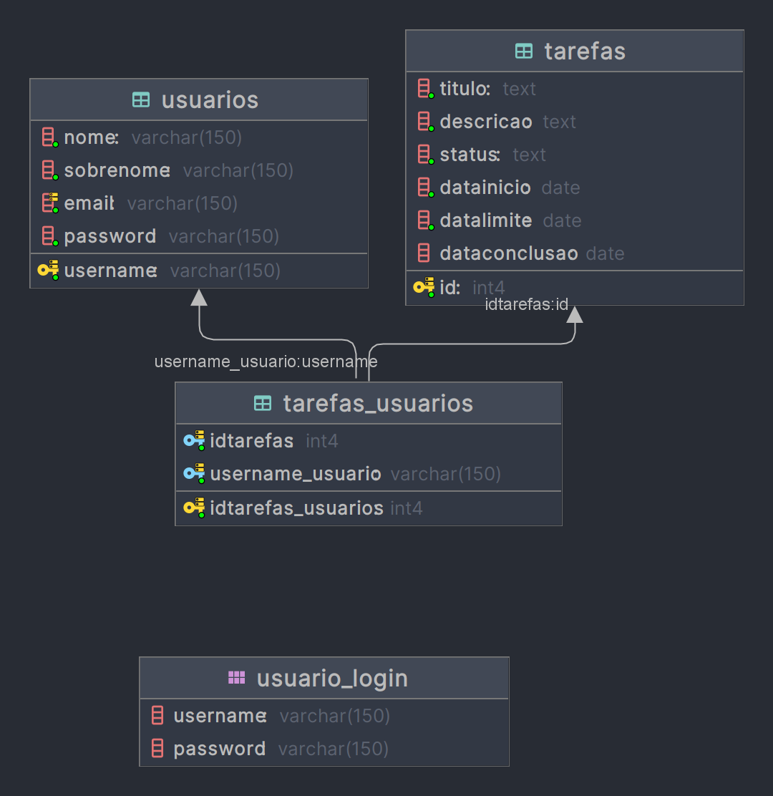

# Documentação do Projeto - Task To-Do em Java

Este é um guia de documentação para o projeto "Task To-Do" desenvolvido em Java e hospedado no GitHub. O projeto consiste em um aplicativo de gerenciamento de tarefas, onde os usuários podem criar, atualizar, excluir e visualizar suas tarefas. O aplicativo utiliza um banco de dados PostgreSQL para armazenar informações sobre tarefas e usuários.

## Banco de Dados

### Diagrama

### Estrutura do Banco de Dados

O banco de dados é implementado no PostgreSQL e possui três tabelas principais: `usuarios`, `tarefas`, e `tarefas_usuarios`.

- **Tabela `usuarios`**: Armazena informações sobre os usuários registrados.

    | Coluna        | Tipo      | Descrição                  |
    |---------------|-----------|----------------------------|
    | username      | varchar   | Nome de usuário            |
    | nome          | varchar   | Nome do usuário            |
    | sobrenome     | varchar   | Sobrenome do usuário       |
    | email         | varchar   | Endereço de e-mail do usuário |
    | password      | varchar   | Senha do usuário           |

- **Tabela `tarefas`**: Armazena informações sobre as tarefas.

    | Coluna           | Tipo      | Descrição                    |
    |------------------|-----------|------------------------------|
    | id               | serial    | Identificador único da tarefa |
    | titulo           | text      | Título da tarefa              |
    | descricao        | text      | Descrição da tarefa           |
    | status           | text      | Status da tarefa (por fazer, em progresso, concluída) |
    | datainicio       | date      | Data de início da tarefa      |
    | datalimite       | date      | Data limite da tarefa         |
    | dataconclusao    | date      | Data de conclusão da tarefa (pode ser nula) |

- **Tabela `tarefas_usuarios`**: Realiza a associação entre tarefas e usuários.

    | Coluna               | Tipo      | Descrição                          |
    |----------------------|-----------|------------------------------------|
    | idtarefas_usuarios   | serial    | Identificador único da associação |
    | idtarefas            | int       | ID da tarefa associada             |
    | username_usuario     | varchar   | Nome de usuário do proprietário da tarefa |

### Chaves Estrangeiras

- A tabela `tarefas_usuarios` possui duas chaves estrangeiras, referenciando as tabelas `tarefas` e `usuarios`. Isso garante que cada tarefa esteja associada a um usuário específico.

### Conexão com o Banco de Dados

A conexão com o banco de dados é gerenciada por meio da classe `ConexaoBancoDados`. Esta classe utiliza o pool de conexões HikariCP para obter e gerenciar conexões com o banco de dados.

## Pacotes e Classes

O projeto é dividido em vários pacotes, e as classes principais são as seguintes:

### Pacote `*.models.repository`

Neste pacote, estão localizadas as classes que lidam com a persistência de dados no banco de dados. As principais classes são:

- `UsuarioDAO`: Realiza operações relacionadas aos usuários, como inserção, atualização, exclusão e busca por nome de usuário. Também verifica se um nome de usuário ou endereço de e-mail já está em uso.

- `TarefaDAO`: Realiza operações relacionadas às tarefas, como inserção, atualização, exclusão, busca e recuperação de todas as tarefas de um usuário.

### Pacote `*.models.entities`

Este pacote contém as classes que representam entidades principais no aplicativo:

- `Usuario`: Representa um usuário e suas informações, incluindo nome, sobrenome, e-mail, senha, entre outros.

- `Tarefa`: Representa uma tarefa, incluindo título, descrição, datas de início e limite, status e data de conclusão.

- `StatusTarefa`: Enumeração que define os possíveis estados de uma tarefa (por fazer, em progresso, concluída).

### Pacote `*.controller`

Este pacote contém classes relacionadas ao controle do aplicativo, como autenticação de usuário e gerenciamento de sessões.

## Uso das Classes

As classes `UsuarioDAO` e `TarefaDAO` são usadas para interagir com o banco de dados e realizar operações relacionadas a usuários e tarefas. A classe `ConexaoBancoDados` gerencia a conexão com o banco de dados usando HikariCP.

Aqui estão as informações sobre as classes e a interface que o usuário deve usar para cadastrar, fazer login e criar uma tarefa em seu aplicativo:

### Classe `AdicionarController`:

Esta classe é responsável pela interface de adição de uma nova tarefa.

Métodos:

- `public void salvarTarefa(ActionEvent event)`: Este método é chamado quando o usuário clica no botão "Salvar". Ele coleta os detalhes da tarefa da interface do usuário, verifica se todos os campos obrigatórios estão preenchidos e, em seguida, cria uma nova tarefa com esses detalhes e a adiciona usando o serviço `TarefaService`.

### Classe `EditarController`:

Esta classe é responsável pela interface de edição de uma tarefa existente.

Métodos:

- `public void salvarTarefa(ActionEvent event)`: Este método é chamado quando o usuário clica no botão "Salvar" após editar uma tarefa. Ele atualiza os detalhes da tarefa selecionada com as informações da interface do usuário e, em seguida, chama o serviço `TarefaService` para atualizar a tarefa no banco de dados.

- `public void setTarefaSelecionada(Tarefa tarefa)`: Este método é usado para carregar os detalhes de uma tarefa selecionada na interface de edição.

- `private void atualizarStatus(ActionEvent event)`: Este método é chamado quando o usuário seleciona um novo status para a tarefa. Ele atualiza o status da tarefa na interface do usuário.

### Classe `LoginController`:

Esta classe é responsável pela interface de login do usuário.

Métodos:

- `public void entrar(ActionEvent actionEvent)`: Este método é chamado quando o usuário clica no botão "Entrar". Ele coleta as informações de nome de usuário e senha da interface do usuário, verifica se esses campos estão preenchidos e, em seguida, chama o serviço `UsuarioService` para autenticar o usuário. Se a autenticação for bem-sucedida, ele redireciona o usuário para a tela principal de tarefas.

- `public void abrirCadastro(ActionEvent actionEvent)`: Este método é chamado quando o usuário clica no botão "Cadastrar". Ele abre a tela de registro de usuário.

### Classe `RegistroController`:

Esta classe é responsável pela interface de registro de um novo usuário.

Métodos:

- `public void salvarUsuario(ActionEvent actionEvent)`: Este método é chamado quando o usuário clica no botão "Salvar". Ele coleta as informações de registro do usuário, verifica se todos os campos obrigatórios estão preenchidos, verifica se o nome de usuário e o email não estão em uso e, em seguida, chama o serviço `UsuarioService` para adicionar o novo usuário ao banco de dados. Após o registro bem-sucedido, ele exibe uma mensagem de sucesso e redireciona o usuário para a tela de login.

### Classe `TabelaController`:

Esta classe é responsável pela interface principal de exibição e gerenciamento de tarefas.

Métodos:

- `public void initialize()`: Este método é chamado durante a inicialização da interface. Ele configura a tabela, os eventos de clique duplo, o menu de contexto e atualiza a lista de tarefas.

- `public void editarTarefaSelecionada()`: Este método é chamado quando o usuário seleciona a opção de "Editar" em uma tarefa da tabela. Ele abre a interface de edição para a tarefa selecionada.

- `public void excluirTarefaSelecionada()`: Este método é chamado quando o usuário seleciona a opção de "Excluir" em uma tarefa da tabela. Ele remove a tarefa do banco de dados após a confirmação do usuário.

- `public void adicionarTarefa()`: Este método é chamado quando o usuário clica no botão "Adicionar Tarefa". Ele abre a interface de adição de uma nova tarefa.

- `public void deslogar()`: Este método é chamado quando o usuário clica no botão "Sair". Ele desconecta o usuário atual e redireciona para a tela de login.

- `private void atualizarTabela()`: Este método atualiza a lista de tarefas na tabela.

- `private void atualizarBarraDeProgresso()`: Este método atualiza a barra de progresso na parte inferior da interface para mostrar o progresso das tarefas concluídas em relação ao total de tarefas.

### Classe `UsuarioLogado`:

Esta classe gerencia o estado de logon do usuário e armazena as informações do usuário logado.

Métodos:

- `public static void setUsuario(Usuario user)`: Define o usuário logado.

- `public static Usuario getUsuario()`: Obtém o usuário logado.

- `public static boolean estaLogado()`: Verifica se um usuário está logado.

- `public static void desconectar()`: Desconecta o usuário logado.

Essas classes e métodos fornecem uma interface para que o usuário interaja com o sistema, realize login, cadastre-se e gerencie suas tarefas. Você pode adaptar essa estrutura ao seu aplicativo específico e personalizar a interface do usuário conforme necessário.

## Observações Finais

Este documento fornece uma visão geral do projeto "Task To-Do" e sua estrutura de banco de dados. Para mais detalhes e informações de implementação, consulte o código-fonte disponível no repositório GitHub do projeto.

Repositório do GitHub: [Task To-Do no GitHub]([URL_DO_SEU_REPOSITORIO_GITHUB](https://github.com/Kainanars/TaskToDo))

Este projeto é uma demonstração de um aplicativo de gerenciamento de tarefas, e você pode expandi-lo e personalizá-lo de acordo com suas necessidades. Boa sorte com o desenvolvimento!