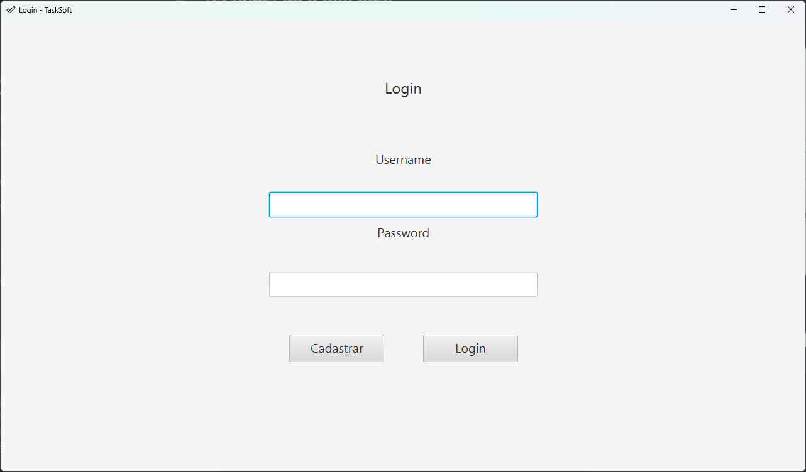

##  Task ToDo

O programa te permite criar, visualizar, editar e remover tarefas, com uma interface intuitiva de tabela e um banco de dados local.

## Diagrama de Classe

## Como utilizar

Para utilizar, siga os passos abaixo:

Baixe a biblioteca do maven e instale. https://youtu.be/edF1G8RYDTU

Acesse a raiz do projeto.

Execute o programa com o comando mvn clean javafx:run . 
Veja os exemplos de comandos abaixo:

- ### Exemplo:

  

       mvn clean javafx:run

Ou execute pelo Intelliji:

- **Exemplo**:

  - ## **Saída:**

    

## Execução:

