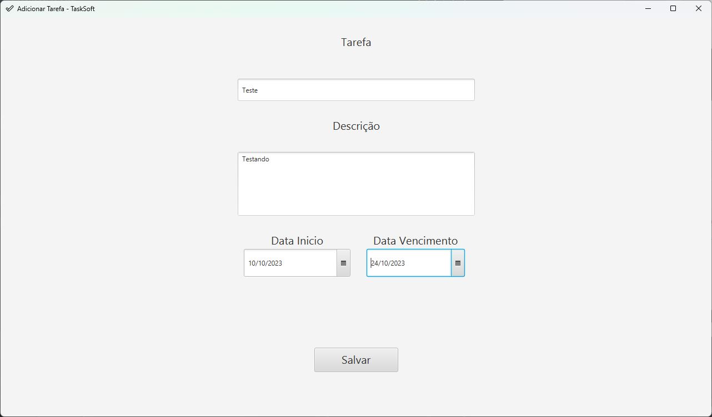

##  Atividade #2

O programa te permite criar, visualizar, editar e remover tarefas, com uma interface intuitiva de tabela e um banco de dados local.

## Princípios SOLID

- **Single Responsibility Principle**: A classe `Tarefa` gerencia informações de tarefas.
- **Open/Closed Principle**: A interface `RepositorioTarefa` define operações de persistência, implementadas em `RepositorioTarefasMemoria`.
- **Liskov Substitution Principle**: `RepositorioTarefasMemoria` respeita a substituição de Liskov.
- **Interface Segregation Principle**: A interface `RepositorioTarefa` não é dividida, pois os métodos são coesos.
- **Dependency Inversion Principle**: O `TabelaController` injeta `TarefaService` para evitar acoplamento.

## Diagrama de Classe

## Como utilizar

Para utilizar, siga os passos abaixo:

Baixe a biblioteca do maven e instale. https://youtu.be/edF1G8RYDTU

Acesse a raiz do projeto.

Execute o programa com o comando mvn clean javafx:run . 
Veja os exemplos de comandos abaixo:

- ### Exemplo:

  

       mvn clean javafx:run

Ou execute pelo Intelliji:

- **Exemplo**:

  - ## **Saída:**

    

## Execução:

Neste programa usei JavaFX juntamente com Gluon Scene Builder para criar os layouts, e implementei no código através dos fxml's. Também fiz o uso do banco de dados SQlite para armazenar os dados das tarefas permanentemente. Foi uma ótima experiência, me frustrei um pouco na hora de compilar o arquivo, pois o meu intuito era gerar o .jar da aplicação, mas tentei inúmeras maneiras e não consegui gerar o .jar que funcionasse corretamente. Gostei de trabalhar com JavaFX, com o Scene Builder consigo explorar alguns designers e desenvolver algo mais intuitivo. É uma pena que o programa da Gluon não exporte o tema que tinha selecionado, a aplicação era para ser com o tema Dark, no entanto mais a frente vou implementar uma estilização com CSS para aplicação.
